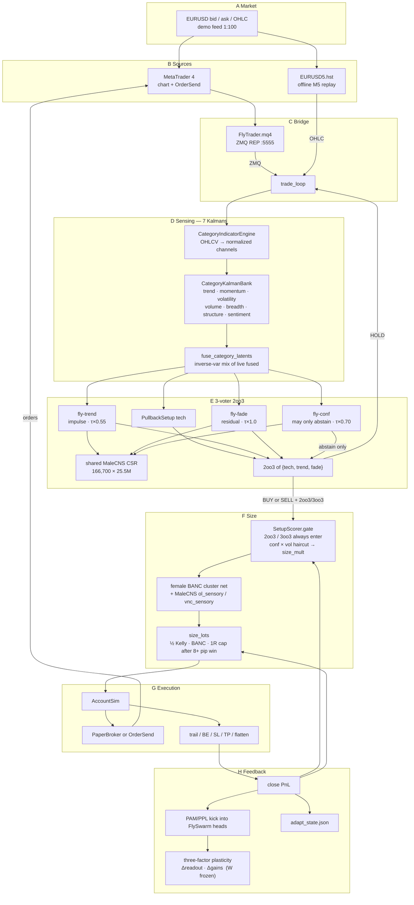
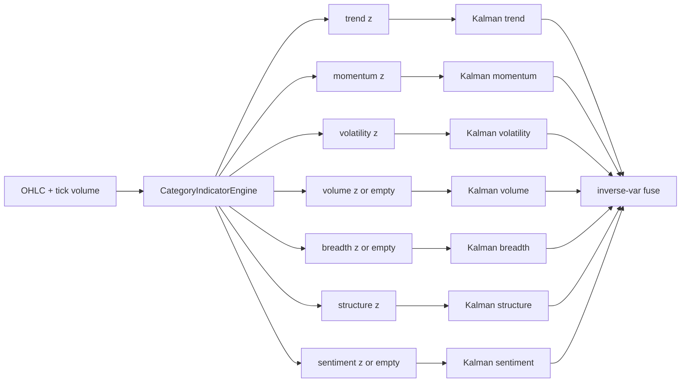
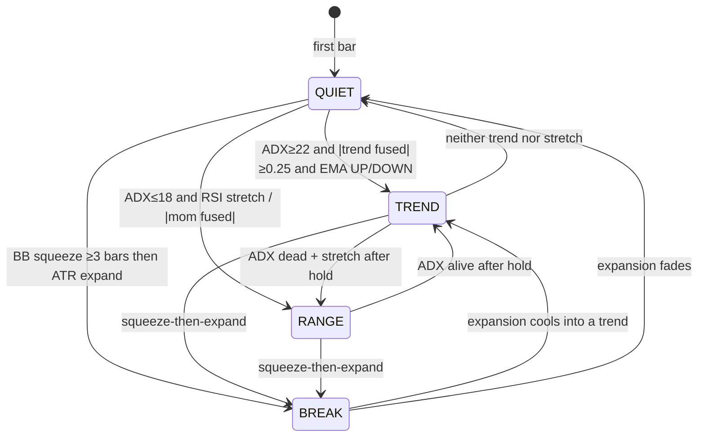
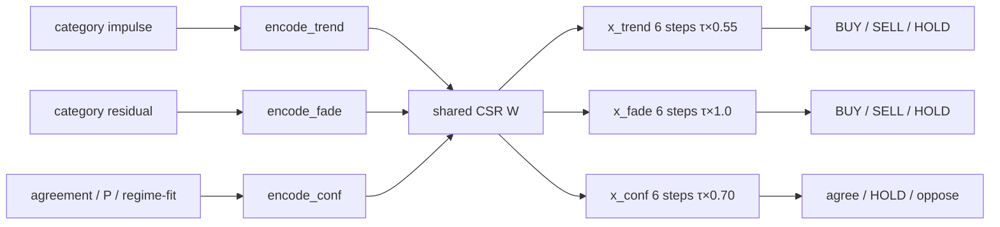
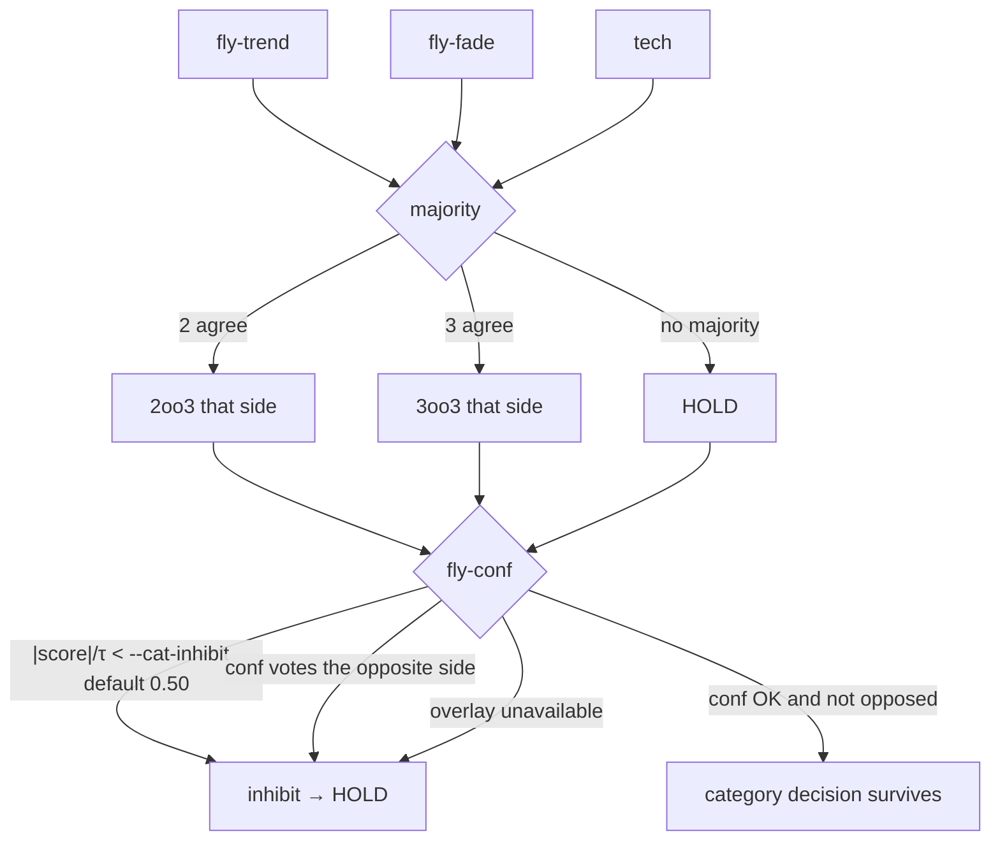
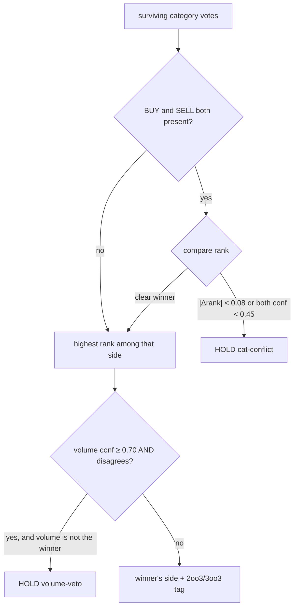

# FlyFOREXTrader — how a bar becomes a trade

Python owns the strategy. MetaTrader 4 is only I/O (quotes and `OrderSend`).

**Default committee (this is what `--gui` and a plain replay run):** seven indicator **categories** each keep a Kalman latent. Those latents are **inverse-variance fused** into one impulse (empty overlays stay out). Then the 3-voter 2oo3 `{tech (PullbackSetup), fly-trend, fly-fade}` runs. Fly-confidence may only abstain. BUY and SELL are never averaged.

The EURUSD freeze mixer is `--legacy-2oo3`. The 21-head 7-category committee is `--categories`. Other opt-in experiments (`--koo9`, `--nest`, `--ensemble`) are documented at the end.

How to run the GUI and CLI: `HELP.md`. Open this file in the editor and preview with **Ctrl+Shift+V** so the diagrams render.

---

## 0. Repo layout

| Path | What it is |
|---|---|
| `fly_forex.py` / `fly_train.py` | Thin CLIs. `python fly_forex.py --gui` still works. |
| `flyfx/` | First-party Python: brain, vote, sense, risk, exec, UI |
| `flyfx/sense/category_indicators.py` | OHLCV suite grouped by category |
| `flyfx/sense/category_kalman.py` | One Kalman per category |
| `flyfx/sense/fuse_regime.py` | Opt-in TREND/RANGE/BREAK/QUIET mix picker |
| `flyfx/vote/category_tech.py` | Seven tech strategy nodes |
| `flyfx/vote/category_vote.py` | 2oo3/3oo3, inhibit, plausibility pick |
| `flyfx/brain/evolve.py` | Genetic Train DA (params + dynamic flags + PAM/PPL; W frozen) |
| `flyfx/brain/category_flies.py` | 7×3 MaleCNS heads on one `W` |
| `flyfx/ui/web/dash.html` | Lab dashboard at `http://127.0.0.1:8765/` |
| `mt4/FlyTrader.mq4` | MT4 ZMQ Expert Advisor; Fuse Inputs + Dynamic mix set the live mix |
| `brains/` | Per-pair dopamine files (EURUSD frozen) |
| `reports/` | Trade CSVs and adapt state |
| `fly-connectome/` | MaleCNS CSR graph (downloaded on first run) |
| `snapshots/` | Frozen winning books. Do not treat as live code. |
| `vendor/` | Third-party trees (`BANC-project-main`, `fly-trader-master`) |
| `docs/ARCHITECTURE.md` | This file |
| `HELP.md` | Operator guide |

---

## 1. End-to-end block diagram

**Bar in one sentence:** indicators → seven Kalmans → inverse-variance fuse → `{tech, fly-trend, fly-fade}` 2oo3 → size with BANC → trade.

---

## 2. Seven indicator categories

Each category Kalman fuses **only** the indicators in that family. Channels are normalized before the mix. Missing / NaN values are **predict-only** and drop out of the mix — they are never invented.

| Category | Role | Live from OHLCV | Unavailable unless extras / volume |
|---|---|---|---|
| **trend** | Direction and strength | SMA, EMA, WMA, MACD, ADX, Parabolic SAR, Ichimoku (unshifted), Supertrend | — |
| **momentum** | Speed / stretch / reversal | RSI, Stochastic, CCI, Williams %R, ROC | — |
| **volatility** | Range expansion / squeeze | Bollinger, ATR, Keltner, StdDev, Donchian | — |
| **volume** | Participation / flow confirm | OBV, CMF, VWAP, A/D **if tick volume > 0** | Volume Profile (needs a tick histogram). All volume channels if volume is 0 (typical Yahoo FX). |
| **breadth** | Broad vs narrow move | — | Advance-Decline, McClellan, Arms Index (TRIN) |
| **structure** | Support / resistance | Pivots, Fibonacci swing, regression channel | Drawn trendlines |
| **sentiment** | Crowd extremes (contrarian) | — | Put/Call, VIX, COT |

Optional bar fields if you have them: `vix`, `put_call`, `cot`, `advance_decline`, `mcclellan`, `trin`. Empty overlay categories stay **HOLD / low confidence**. They do not fake a side.

HST tick volume is passed through, so the volume category can wake up on MT4 history even when Yahoo prints 0.

### Inside one category Kalman

1. Each live channel has a `Kalman1D`. `step(None)` on a missing series (predict only).
2. Live posteriors are **inverse-variance mixed** into one latent.
3. That mix is tracked by another `Kalman1D` plus a `KalmanCV` (level + slope).
4. Downstream sees: `impulse` (tanh of fused), `residual` (mix − level), `P` / uncertainty, innovation, agreement, `n_live / n_expected`, regime UP / DOWN / CHOP.

Each category Kalman inverse-variance mixes only the **indicator channels you selected** (`--fuse-inds` / GUI rows under FUSE / MT4 indicator Inputs; default every channel). Unselected channels are still Kalman-stepped so they stay warm if you turn them back on, but they do not enter the fused latent. Missing overlays stay out — they are not faked.

The rest of the stack reads `feat["impulse"]` — that is now the **inverse-variance mix** of the category latents you selected (`--fuse-cats` / GUI FUSE boxes / MT4 FlyTrader Inputs when live; default all live), not an EMA+RSI+ATR blend and not trend-only unless you pick trend. The old mixer is stored as `feat["kalman"]["legacy"]` and is the trade source only under `--legacy-2oo3`. The 21-head committee is `--categories`.

### Risk tolerance (closes)

`--risk-tol` / GUI **RISK** / MT4 `InpRiskTol` selects how an **open** trade gets closed. `balanced` (default) leaves AdaptiveParams geometry alone and does **not** add risk-factor exits — freeze-identical on `--legacy-2oo3` if you also leave this at balanced. `conservative` overlays tighter SL/TP/trail/hold and flattens on BANC drop, opposite fly-fade, Kalman uncertainty, ATR blow-up, or the rails kill switch. `aggressive` overlays wider geometry and holds longer; extra risk-factor exits stay off.

`--risk` is still lot-sizing percent. Risk tolerance is the close-side profile. Live: the EA `RISK|…` token wins over the GUI.

### Sugar (native lamp vs feed overlay)

**Native lamp (sugar feed off — 4k-era):** the 23 MaleCNS sugar GRNs still receive `0.45 × nice` on the BANC/risk pass (`nice` = edge + free margin). That activity sits on the risk state and leaks through `W` into the MaleCNS risk voter. It does **not** skip, resize, or flatten, and it never votes BUY/SELL. MALECNS paints those cells from the risk-pass copy on `sugar_x`.

**Feed overlay (sugar feed on):** a separate satiety tank (equity vs peak, day's gain, floating profit, trades today) mixes with a local GRN stamp (food = 2oo3/clean). Appetite sizes / skips / snowballs / spits out winners. **Dose** (`--sugar-amt` / GUI **amt** / MT4 `InpSugarAmt`, default 1) scales the overlay: `0` eats like the lamp-only path, `1` is the full policy, `2` is extra size. **DYNAMIC sugar** (`--sugar-dyn` / GUI **DYNAMIC sugar** / MT4 `InpSugarDyn`, off by default) is FEAST/FORAGE/NIBBLE/FAST. Unchecking sugar feed / `--no-sugar` restores the lamp-only path on the current cat-fuse voters + FUSE indicators + DYNAMIC mix. The old EMA/RSI/ATR mixer is CLI `--legacy-2oo3` only.

**Per-fly crops (`--fly-crops` / GUI per-fly crops, needs sugar feed):** each FlySwarm head (trend, fade, conf, risk) keeps a virtual crop. Satiety comes from *that* head’s attributed R, not the account. A full fly is muted to HOLD (sugar still never casts BUY/SELL), then 2oo3 runs. On close, only heads that earned the R get PAM/PPL, scaled by hunger × `drive_from_results_risk` (crop PF × BANC/rails/ATR/`--risk-tol`). Default off so the EURUSD freeze and shared-DA path stay identical. Snapshot: `snapshots/pre-fly-crops-20260921/`.

### Genetic Train DA (evolve)

GUI **Train DA** with **evolve** (default on) / `python fly_train.py --evolve` runs a population of genomes for several generations. W stays frozen. Each member:

1. Carries AdaptiveParams (SL/TP/trail/RSI/impulse/hold) plus dynamic flags (RISK, sugar on/amt/DYNAMIC sugar, DYNAMIC mix, FUSE allowlist, snowball, martingale).
2. Trains PAM/PPL on the history window (same shadow DA as a single Train DA).
3. Is scored on net USD minus drawdown (zero fills rank last; overtrading is penalized).

Elites keep their traces and walked params (Lamarckian). Children mutate/crossover the genome and inherit DA from the fitter parent. The survivor is written to two files:

- `brains/{PAIR}.evo.json` — AdaptiveParams + dynamic flags (RISK, sugar, DYNAMIC mix/sugar, FUSE cats/indicators, snowball, martingale). Replay + **use evolved** / `--use-evo` loads this (`evo loaded brains/{PAIR}.evo.json`). The PAIR menu shows **· evo**.
- `brains/{PAIR}.json` — PAM/PPL traces (`genome` is also nested here). Replay + **use DA brain** / `--use-brain` loads traces. If **use evolved** is off, a nested genome still applies when present.

Live still lets the EA win mix/sugar/risk. GUI Train DA writes EURUSD like any pair. Empty overlays stay out — fuse-cat bits never fake volume/breadth/sentiment.

### Payoff book

Entries have to agree with the slow EMA (288 M5 bars, about one day). A flat or opposed day is a skip, on every pair. The working stop is the initial risk R. At 1R the stop moves to entry. The trail does not start until 2R, and then it sits half an R behind the extreme. A planned round trip that costs more than 0.40 of that stop is skipped. The local Kalman regime can still be up for an hour inside a down day; that hour is not a long. Held-out checks on the last two weeks of the Yahoo 5-minute tape are still negative after costs, and a day-trend hold scanned on the month before that was negative at every stop width tried.

### Dynamic scalp risk (not a per-pair fit)

The stated risk percent is the ceiling. Each entry multiplies it by the current tape, and that multiplier is the same function on every pair (`flyfx/risk/conditions.py`). It uses only the bar in front of the book:

- **cost** — round-trip spread and slip versus the stop. A wide spread takes less size.
- **vol** — ATR relative to its slow ATR. A dead tape and a volatility spike both take less; the middle takes full size.
- **liquidity** — UTC clock. London/New York overlap (12:00–16:00) is full size. London morning, the open, and Tokyo are smaller.
- **chase** — impulse near saturation means the move is already gone, so size comes down.
- **heat** — consecutive losses cut the next bet. A scratch does not increase size.

The product of those five is clipped to 1, so a quiet friendly tape cannot raise risk above the percent you set. A separate cycle thrust can. Six M5 bars are one cycle. Rate of change is that move in ATR, and the jump is this cycle minus the last. When the jump runs with the trade, size rises in proportion, up to twice, and still not past the shared risk cap. The same jump while a winner is open can add up to 80% of the original lots, twice, and never past twice the open size. When the cycle turns against a trade that is already in profit, the book flattens on that bar. Once a trade has paid the round trip, the stop moves to entry. A trade that still has not paid its spread is scratched after half an hour if the regime or the impulse has left, and after an hour regardless.

Factory 2oo3/3oo3 gates, the circuit, and snowball fractions stay the shared defaults. A `risk_factors` blob on a brain file is not loaded and is not what sizes the next trade.

### Dynamic fuse regime (opt-in)

`--fuse-dynamic` / GUI **DYNAMIC mix** / MT4 `InpFuseDynamic` turns on a 4-state machine that picks *which* Kalmans enter that mix. The 3-voter 2oo3 stays `{tech, fly-trend, fly-fade}`. FUSE boxes remain an **allowlist** the machine intersects. Sparse overlays that never measured stay out — they are not faked.

Inputs are the **engine** ADX / ATR ratio / Bollinger bandwidth / RSI and the **per-category** fused latents. The mix’s own regime is not an input (that would be circular).

| State | Mix (∩ allowlist) |
|---|---|
| **TREND** | trend + structure (+ volume if live and \|fused\|≥0.20) |
| **RANGE** | momentum + structure (+ volume if live) |
| **BREAK** | volatility + trend (+ volume if live) |
| **QUIET** | trend (+ volume if live) |

Hysteresis: 8 bars in a state before leaving, plus ADX dead-bands (TREND stays while ADX≥16, RANGE stays while ADX≤22). BREAK may leave early to TREND or QUIET. Empty intersection falls back to trend if allowed, else the first allowlisted name. Off by default. Ignored by `--legacy-2oo3` / `--categories`.

---

## 3. Tech (default: one PullbackSetup)

Default 2oo3 uses **one** tech node (`PullbackSetup`): arm bounce/continuation on the fused Kalman regime; CHOP → HOLD.

`--categories` restores seven tech nodes (`run_category_tech()`). Overlay categories with no data return HOLD at strength 0.

| Category | Logic |
|---|---|
| **trend** | Trade with the prevailing trend. Buy when short-term crosses above long-term / impulse turns up and ADX is not dead. Sell on the reverse. Skip chop (low ADX and weak impulse). Stay with strength; wait when it fades. |
| **momentum** | Fade stretch. Buy oversold (RSI / stoch / %R / CCI) or bullish divergence. Sell overbought or bearish divergence. Stronger when ADX says range-bound. |
| **volatility** | Buy a squeeze breakout beyond a band. Stand aside when ATR is already extreme (also haircuts lots 0.75 / 0.88). |
| **volume** | Confirm: price up and flow up → BUY. Invalidate: price up and flow fails → SELL. Signed vote, used mainly as a filter (see volume veto below). |
| **breadth** | Buy when participation confirms; sell/caution when the move is narrow. HOLD if the overlay is missing. |
| **structure** | Buy bounce at support or confirmed break above resistance. Sell rejection at resistance or breakdown. Uses volume/momentum fused states as light confirmation when they exist. |
| **sentiment** | Contrarian: buy fear, sell greed. HOLD if VIX / put-call / COT are missing. |

Volume, breadth, and sentiment are allowed to **win** the trade if they have the highest surviving confidence. Neutral overlays never block a directional winner.

---

## 4. Three fly brains (default: one FlySwarm)

`W` is loaded **once**. Default `FlySwarm` keeps **3** state vectors `{trend, fade, conf}` on the fused impulse. `--categories` uses `CategoryFlyPool` (21 heads). Same retina encoders.

Unavailable overlay categories **skip** the mix (and, under `--categories`, skip the net and return HOLD with `conf_norm = 0`).

| Head | Drive | τ scale | What it votes |
|---|---|---|---|
| **fly-trend** | 75% impulse / 25% residual of *that* category | ×0.55 (looser, votes more) | with-trend side |
| **fly-fade** | 80% residual / 20% impulse | ×1.0 (full τ, only when sure) | fade / mean-revert side |
| **fly-conf** | agreement, 1−uncertainty, n_live fraction, regime-fit — **not price** | ×0.70 | agree / HOLD / oppose. Does **not** cast a side into 2oo3. |

Regime-fit examples: trend-conf is higher when ADX is trending; momentum-conf is higher in a range; volume/breadth/sentiment-conf collapse when the overlay is empty.

Each window is 6 leaky-tanh substeps (vs 10 on the old 3-head swarm) so 21 heads stay affordable. `SYN_GAIN = 0.02`, `λ = 0.15`. Connectome `W` stays frozen (measured synapses). Dopamine after a close is deposited on the **winning category’s** three heads.

The GUI’s three retina cards are the **winning classification’s** heads, not a global fly-trend.

BANC has **no retina**. Risk is mapped onto female neck clusters (threat / walking / tactile / feeding) mixed with MaleCNS `ol_sensory` and `vnc_sensory`. That multiplier scales lots, can block a weak bounce, and can refuse a snowball. It does **not** veto a 2oo3.

---

## 5. Per-category 2oo3 / 3oo3 and confidence inhibit

Voters inside a category are **only** `{fly-trend, fly-fade, tech}`. Fly-conf is a gate, not a fourth voter.

| Result | Meaning |
|---|---|
| `3oo3` | trend, fade, and tech all BUY or all SELL |
| `2oo3` | exactly two agree; the third is HOLD or the other side does not outvote them |
| `HOLD` | no majority |
| inhibited | would have been 2oo3/3oo3, but fly-conf is low, opposed, or the category has no live measurements |

`--no-fusion` sets the inhibit threshold to 0 (categories still vote; they are not silenced for low conf). `--cat-inhibit` changes the bar.

---

## 6. Cross-category plausibility pick

`pick_plausible()` looks at every category that still has BUY or SELL after inhibit. **One** of them becomes the trade.

**Rank** = fly-conf `|score|/τ`, plus **+0.08** if the vote is `3oo3`. So a unanimous category beats a slightly more confident 2oo3.

Rules that matter:

- Prefer **3oo3** when confidence is comparable, then highest confidence.
- BUY vs SELL is **never blended**. Higher rank wins, or HOLD if they are too close / both weak.
- Neutral volume / breadth / sentiment do **not** block.
- Volume **vetoes** only when volume confidence ≥ 0.70 **and** it disagrees with a non-volume winner.
- `flow_algo` still cannot open a trade. If it agrees with the winner, the tag becomes `2oo3+flow` / `3oo3+flow` so the existing gate/sizing path still works.

The dashboard shows: winner, vote type, confidence, inhibited list, losers, and any conflict string. The MALECNS card paints live `|x|` on a T-shaped schematic of optic lobes + central brain + VNC (superclass compartments; not measured soma xyz).

### Indicator rationality

After 2oo3 (and after the day-bias veto), `flyfx/vote/rational.py` checks the proposed side against readings that did not cast the vote. Trend: EMA 21/55, ADX with +DI/−DI, parabolic SAR, Supertrend, Ichimoku cloud. Momentum: MACD histogram, RSI, and one oscillator vote from stochastic, Williams %R, and CCI together. A missing reading abstains. The side is kept when at least two trend readings and one momentum reading agree, and supporters outnumber opponents by two. Clean agreement keeps full size. A thinner agreement, or one dissent, takes 0.85 or 0.70. The side is refused when RSI, stochastic, and Bollinger % are all pinned at the extreme (a chase), or when the tape does not clear that bar. The same check blocks a thrust add and a snowball add. It does not flatten a trade that is already open.

---

## 7. After the pick — size, snowball, exit

Same plumbing as before. The committee tag is still `2oo3` / `3oo3` (optionally `+flow`), so `SetupScorer.gate` does not need a new enum. On the fill, a forecast sets a target from the half-hour rate of change and the impulse, in ATR, over the next 12 M5 bars. If that price prints inside the window and the trade is ahead of its spread, the book closes. If price runs the other way by about half the initial risk inside that same window, the book closes before the full stop. After the hour, the forecast goes quiet and the payoff stop remains.

| Tag | Size (then × conf, × vol haircut, × BANC) |
|---|---|
| `3oo3+flow` | ~1.25 × Bayesian risk |
| `3oo3` | ~1.18 × |
| `2oo3+flow` | ~1.05 × |
| `2oo3` | ~1.00 × |
| `cat-silent` / `cat-conflict` / `volume-veto` | no trade |

Confidence **does not skip** a 2oo3 / 3oo3 at the sizer. Category fly-conf already skipped weak classifications upstream. The scorer still multiplies `size_mult`. Similar-setup kernel can still skip if that exact pattern has been losing. Extreme ATR haircuts lots 0.75 / 0.88 on this path; the stop itself stays on the existing ATR geometry.

**Snowball (default on).** At most two adds, each ~55% of the first slice. Requires fly-trend on-side, no fade veto, regime still with the trade, profit past BE but not yet trailing, a small pullback, floating USD ≥ 1.50× the add’s stop risk, and BANC ≥ 0.85. Trail stays on the first fill.

**Recovery martingale (default on).** After a scratch 2oo3 loss (< 0.45R), next size is ×1.20, then ×1.28, then stop. Kill switch at 2.5% from peak (1.0% after a snowball win) on **balanced**. Conservative uses a 1.5% kill and can flatten the open trade; aggressive 4.0%.

---

## 8. Connectome counts

| Piece | Count | Role |
|---|---|---|
| Neurons / synapses | 166,700 / 25.5M | Shared sparse `W[post, pre]` |
| Retina | 3,335 | Only sensory port; bull half / bear half |
| Descending | 1,314 | Shared linear readout |
| Dopamine | 340 | Reward current on the winning category’s heads after close |
| Category heads | 3 (or 21 with `--categories`) | Own `x` and `r`; same `W` |

Full ~188k BANC edgelist streams from CAVE if `CAVE_TOKEN` is set; without a token the cluster net is the live path.

---

## 9. Functional allocation

| Layer | Function | Allocated to | File |
|---|---|---|---|
| Market / terminal | Quotes, history, `OrderSend` | MT4 + EA | `mt4/FlyTrader.mq4` |
| Bridge | REQ/REP `:5555`, `.hst` replay | `MT4Bridge` / `--hst` | `flyfx/trader.py` |
| Sensing | 7-category Kalman + inverse-var fuse | `Indicators`, `CategoryKalmanBank` | `flyfx/trader.py`, `flyfx/sense/` |
| Connectome graph | Shared CSR matvec | `FlyBrain.W` | `flyfx/trader.py`, `fly-connectome/` |
| 3 fly heads | Fused impulse trend / fade / conf | `FlySwarm` | `flyfx/trader.py` |
| 21 fly heads | Per-category (opt-in `--categories`) | `CategoryFlyPool` | `flyfx/brain/category_flies.py` |
| Female risk | BANC cluster + MaleCNS VNC/olfactory | `BancRiskBrain` | `flyfx/brain/banc_risk.py` |
| Sugar feed | 23 GRNs + satiety tank + dose 0–2 + optional FEAST/FORAGE/NIBBLE/FAST; opt-in `--fly-crops` per-head tanks | `vote_sugar`, `mix_appetite`, `SugarDoseMachine`, `FlyCropPool` | `flyfx/brain/sugar_feed.py`, `flyfx/brain/fly_crop.py` |
| Dopamine RL | Eligibility × DA on readout/gains | `HeadPlasticity` | `flyfx/brain/plasticity.py` |
| Tech | PullbackSetup (or per-category with `--categories`) | `PullbackSetup` / `run_category_tech` | `flyfx/trader.py`, `flyfx/vote/category_tech.py` |
| Flow | Regime voter for size tag only | `flow_algo` | `flyfx/trader.py` |
| Committee | 3-voter 2oo3 on fused impulse | `majority_2oo3` | `flyfx/trader.py` |
| Confidence (sizer) | Lot multiplier, not a skip bar | `SetupScorer.gate` | `flyfx/risk/bayes_sizer.py` |
| Sizing | Risk% × ½ Kelly × size_mult | `size_lots` | `flyfx/trader.py`, `flyfx/risk/bayes_sizer.py` |
| Hidden risk | Tape-fit of internal size/circuit/snowball numbers, per pair brain | `fit_latent` | `flyfx/risk/latent.py` |
| Snowball | Pyramid into winners paid by float | `snowball_add_lots` | `flyfx/trader.py`, `flyfx/exec/account_sim.py` |
| Dashboard | Live 7-Kalman fuse + 3-voter lab | `--gui` | `flyfx/ui/dash.py`, `flyfx/ui/web/dash.html` |
| Geometry | Trail / SL / TP; `--risk-tol` overlays conservative/aggressive | `AdaptiveParams`, `risk_close_reason` | `flyfx/risk/bayes_sizer.py`, `flyfx/risk/tolerance.py` |
| Execution | Costs, margin, trail | `AccountSim`, `PaperBroker` | `flyfx/exec/account_sim.py` |
| Feedback | Dual DA, Bayes, tax, persist | `close_now` | `flyfx/trader.py` |

---

## 10. Signals

| Signal | From | To | Role |
|---|---|---|---|
| OHLC | MT4 or `.hst` | `CategoryIndicatorEngine` | Clock |
| category `z` | indicators | that category’s Kalman | Measurements; NaN → predict-only |
| `impulse` / `residual` | `fuse_category_latents` | FlySwarm + PullbackSetup | Trend vs extension |
| `feat["impulse"]` | mix of live category Kalmans | rest of stack / CHOP skip | Not EMA+RSI+ATR unless `--legacy-2oo3` |
| `tech` | PullbackSetup | 2oo3 | Timing |
| `fly-trend` / `fly-fade` | `FlySwarm` | 2oo3 | Diversity + veto |
| `fly-conf` | `encode_conf` | fusion abstain | Low or opposed → HOLD |
| `tag` | 2oo3/3oo3 (+flow) | `gate` | Size bucket |
| `flow` | `flow_algo` | size tag only | Cannot open a trade |
| `conf %` | SetupScorer | `size_mult` | Scales lots |
| `lots` | `size_lots` | AccountSim | 1R cap only after an 8+ pip win |
| net USD | close | FlySwarm DA, Bayes, tax, CSV | Learning |

---

## 11. Control loops

**Bar loop.** Update 7-category indicators and Kalmans → inverse-var fuse → quotes → if in session and not CHOP (or already in a trade): PullbackSetup tech + 3 flies, 2oo3. If flat and BUY/SELL: `gate` → `size_lots` → open. If in a trade: trail / BE from the **original** entry, then snowball if fly-trend still agrees, then flatten / stop.

**Connectome loop.** Three leaky-tanh passes on the **same** `W`. Replay batches live heads into one streamed `W @ X` per substep and splits rows across threads. Trend uses `τ×0.55`. Fade uses full `τ`. Conf uses `τ×0.70`. DA from the last close is deposited on the three `r` vectors. `--categories` runs up to 21 heads instead.

**Learning loop.** Close updates Beta win-rate, Normal win/loss pips, calibration bins, scorer weights, trail/SL/TP (not RSI / min-impulse), a PAM/PPL dopamine pulse into the winning heads, and a three-factor plasticity step. `W` stays frozen. `--reset-adapt` starts from priors. `--gui` opens `http://127.0.0.1:8765/`. `--overfit` replays the majors on the EURUSD window.

**Weekly dopamine train (other pairs).** `python fly_train.py` walks Yahoo/HST M5 *before* the EURUSD eval week and writes `brains/{PAIR}.json`. With `--evolve` it also writes `brains/{PAIR}.evo.json`. The GUI **Train DA** button does the same for one pair from the DATA file / path (or HST/Yahoo). Replay does **not** load traces unless **use DA brain** / `--use-brain`, and does **not** load the evolved policy unless **use evolved** / `--use-evo`. GUI Train DA writes EURUSD like any pair.

---

## 12. Opt-in committees (not the default)

These **replace** the cat-fuse 3-voter when the flag is on. `--koo9` / `--nest` / `--ensemble` still win over `--categories`. `--legacy-2oo3` (alias `--no-categories`) restores the EURUSD freeze book (`+$1,906.66` on the 9–18 Sep 2026 M5 window).

| Flag | What it is | Hold-out note |
|---|---|---|
| *(none)* | 7 Kalman fuse → 3-fly 2oo3 | New default. Compare against `--legacy-2oo3` before treating PnL as a win. |
| `--legacy-2oo3` | EMA/RSI/ATR mixer + 3-voter `{tech, fly-trend, fly-fade}` | EURUSD freeze `+$1,906.66` |
| `--categories` | 7-category Kalman committee (21 heads) then confidence pick | EURUSD 7 trades 2W/5L `-$220` |
| `--nest` | 9 nodes: 3 families of 3oo3, then 2oo3 of families | EURUSD `-$1,158` |
| `--koo9` | Nine diverse flies, 5oo9–9oo9 | EURUSD `-$1,560` |
| `--ensemble` | Five strategy books, Bayesian mix | EURUSD `+$3,063` but 7-pair mean `-$284` |

### Legacy 3-voter 2oo3 (`--legacy-2oo3`)

PullbackSetup tech + fly-trend + fly-fade. Kalman+Bayes fusion on each node may **abstain only**, never flip. fly-conf sets the abstain bar. Snapshot: `snapshots/eurusd-snowball-lock-20260919/`.

### Nested 3×3oo3 then 2oo3 (`--nest`)

| Family | Methods (must be unanimous) |
|---|---|
| structure | PullbackSetup, EMA hold, rejection candle |
| momentum | fly-trend, `flow_algo`, Kalman impulse sign |
| fade | fly-fade, RSI stretch, Kalman residual |

Any family voting the opposite side is a veto. A silent family is not.

### Nine diverse flies (`--koo9`)

Heads: trend, fade, boll, vol, rsi, macd, flow, mix, struct. Agreement `k` sets volume. A 5–4 split does not trade (`net ≥ 2`). Wide-spread pairs need `k ≥ 6`. `--nest` wins if both flags are set.

---

## 13. Modes

| Mode | Flag | Orders | Prices |
|---|---|---|---|
| LIVE | EA attached | yes | MT4 ticks |
| PAPER | `--paper` | no | MT4 ticks |
| REPLAY | `--hst auto` | no | `.hst` |
| DRY-RUN | `--dry-run` | no | synthetic |

Demo / sim only. Seven category Kalmans fused into three fly heads are a filter — not a guarantee of live profit.
