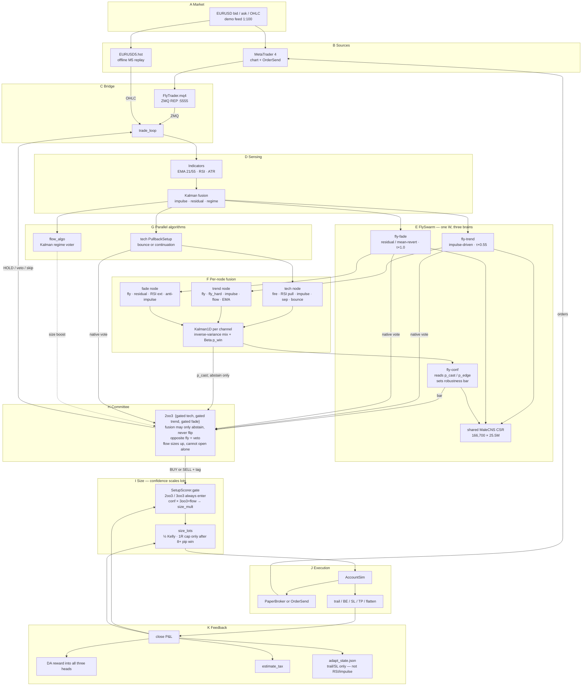
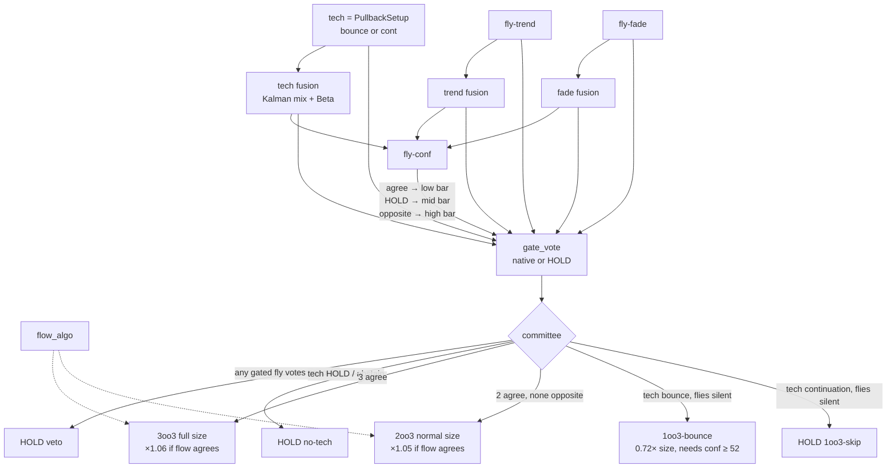
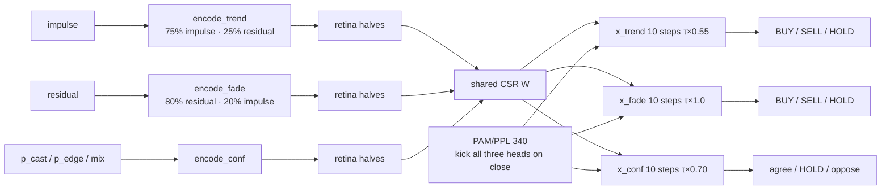

# FlyFOREXTrader — functional allocation and data flow

How the pieces connect, including **three MaleCNS fly instances** on one shared wiring diagram, **Kalman + Bayesian fusion on each 2oo3 node**, and a **confidence fly** that only lets a node vote when the fused evidence is robust. Python owns the strategy; MetaTrader 4 is only I/O.

Open this file in the editor and preview with **Ctrl+Shift+V** so the diagrams render.

---

## 1. End-to-end block diagram

---

## 2. 2-out-of-3 decision

Timing still comes from **tech**. Each of tech, fly-trend, and fly-fade is a fusion node: several channels go through Kalman1D, an inverse-variance mix, and a Beta `p_win`. **fly-conf** reads those `p_cast` values plus `p_edge` and raises or lowers the bar. Fusion may **only abstain** — it never replaces a pullback fire with a lagged mix vote.

A profitable 2oo3 snapshot (no fusion) lives in `snapshots/2oo3-swarm-20260919/` (`+$982.86` on this HST week). `--no-fusion` restores that path without copying files.

| Tag | Meaning | Size |
|---|---|---|
| `3oo3+flow` | tech + trend + fade agree, flow agrees | ~1.25 × Bayesian risk |
| `3oo3` | all three committee voters agree | ~1.18 × |
| `2oo3+flow` | two agree, flow agrees, no opposite | ~1.05 × |
| `2oo3` | two agree, no opposite | ~1.00 × (then × conf) |
| `1oo3-bounce` | silent flies on a true pullback | ~0.72 ×, high conf only |
| `veto` | fade or trend voted the other way | no trade |
| `1oo3-skip` | continuation without a fly | no trade |

Confidence **does not skip** a 2oo3 / 3oo3. It multiplies `size_mult`. Similar-setup kernel can still skip if that exact pattern has been losing.

---

## 3. Connectome — three instances, one graph

`W` is loaded once. Each head has its own state `x` and dopamine `r`. Same descending readout, different retina drive. fly-conf is driven by robustness features (`p_edge`, `p_cast`, fused mix), not by price.

| Piece | Count | Role |
|---|---|---|
| Neurons / synapses | 166,700 / 25.5M | Shared sparse `W[post, pre]` |
| Retina | 3,335 | Only sensory port; bull half / bear half |
| Descending | 1,314 | Shared linear readout |
| Dopamine | 340 | Reward current on **both** heads after close |
| fly-trend | own `x` | Follows the Kalman trend (looser τ) |
| fly-fade | own `x` | Fades extensions; vetoes chase / dump-continuation |
| fly-conf | own `x` | Reads fused `p_cast` / `p_edge`; sets the abstain bar |

`SYN_GAIN = 0.02`, `λ = 0.15`. Each window zeros its own `x`. Fade uses full `τ` so it only votes when the residual story is strong.

---

## 4. Functional allocation

| Layer | Function | Allocated to | File |
|---|---|---|---|
| Market / terminal | Quotes, history, `OrderSend` | MT4 + EA | `mt4/FlyTrader.mq4` |
| Bridge | REQ/REP `:5555`, `.hst` replay | `MT4Bridge` / `--hst` | `fly_forex.py` |
| Sensing | EMA / RSI / ATR / Kalman | `Indicators`, `IndicatorKalmanFusion` | `fly_forex.py`, `kalman_signal.py` |
| Connectome graph | Shared CSR matvec | `FlyBrain.W` | `fly_forex.py`, `fly-connectome/` |
| Fly instance 1 | Trend vote | `FlySwarm` trend head | `fly_forex.py` |
| Fly instance 2 | Fade / reversion vote | `FlySwarm` fade head | `fly_forex.py` |
| Fly instance 3 | Robustness / conf bar | `FlySwarm` conf head | `fly_forex.py` |
| Algo 1 (tech) | Pullback bounce / continuation | `PullbackSetup` | `fly_forex.py` |
| Algo 2 (flow) | Regime voter for size | `flow_algo` | `fly_forex.py` |
| Node fusion | Kalman mix + Beta `p_cast` | `FusedNode`, `gate_vote` | `node_fusion.py` |
| Committee | 2oo3 + veto | `committee()` | `fly_forex.py` |
| Confidence | Size multiplier, not a skip bar | `SetupScorer.gate` | `bayes_sizer.py` |
| Sizing | Risk% × ½ Kelly × size_mult | `size_lots`, `BayesianSizer` | `fly_forex.py`, `bayes_sizer.py` |
| Geometry | Trail / SL / TP only | `AdaptiveParams` | `bayes_sizer.py` |
| Execution | Costs, margin, trail | `AccountSim`, `PaperBroker` | `account_sim.py` |
| Feedback | Dual DA, Bayes, tax, persist | `close_now` | `fly_forex.py` |

---

## 5. Signals

| Signal | From | To | Role |
|---|---|---|---|
| OHLC | MT4 or `.hst` | Indicators | Clock |
| `impulse` | Kalman | fly-trend, tech, flow | Trend strength |
| `residual` | KalmanCV | fly-fade | Extension to fade |
| `regime` | Kalman / EMA | tech, flow, CHOP skip | No flies on CHOP |
| `tech` | PullbackSetup | fusion node, then committee | Timing (bounce vs cont) |
| `fly-trend` / `fly-fade` | FlySwarm | fusion node, then committee | Diversity + veto |
| `p_cast` | FusedNode Kalman+Beta | fly-conf, `gate_vote` | Robustness of that node |
| `fly-conf` | encode_conf | `conf_bar` | Agree / HOLD / oppose → abstain bar |
| `flow` | `flow_algo` | size tag only | Cannot open a trade |
| `tag` | committee | `gate` | 3oo3 / 2oo3 / bounce / veto |
| `conf %` | SetupScorer | `size_mult` | Scales lots; does not block 2oo3 |
| `lots` | size_lots | AccountSim | 1R cap only after an 8+ pip win |
| net USD | close | both DA heads, Bayes, tax, CSV | Learning |

---

## 6. Control loops

**Bar loop.** Update indicators → quotes → if flat, in session, not CHOP: run **trend + fade** heads, fuse each node, run **fly-conf**, `gate_vote`, `committee` → if BUY/SELL, `gate` → `size_lots` → open. In a trade: trail / BE / flatten / stop.

**Connectome loop.** Three 10-step leaky-tanh passes on the **same** `W`. Trend uses `τ×0.55` (votes more). Fade uses full `τ` (vetoes only when sure). Conf uses `τ×0.70` on robustness features. DA from the last close is deposited on **all three** `r` vectors.

**Learning loop.** Close updates Beta win-rate, Normal win/loss pips, calibration bins, scorer weights, trail/SL/TP (not RSI / min-impulse), each node's Beta `p_win`, and `reports/adapt_state.json`. `--reset-adapt` starts from priors. `--no-fusion` skips the gate (restore `snapshots/2oo3-swarm-20260919`).

---

## 7. Modes

| Mode | Flag | Orders | Prices |
|---|---|---|---|
| LIVE | EA attached | yes | MT4 ticks |
| PAPER | `--paper` | no | MT4 ticks |
| REPLAY | `--hst auto` | no | `.hst` |
| DRY-RUN | `--dry-run` | no | synthetic |

Demo / sim only. Three copies of a real fly wiring diagram plus fused 2oo3 voting are a filter — not a guarantee of live profit.
